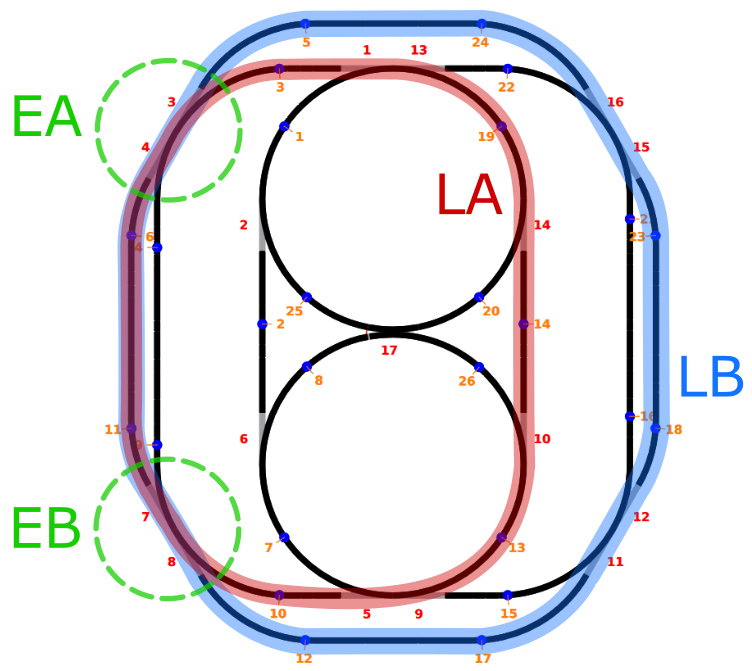

# Titre du laboratoire

**Auteurs :** Emmanuelle Comte, Fabien Terrani, Yanick Thomann

## Préambule

### Code

Les `TODO` de la consigne originale ont été conservés afin de facilement retrouver les sections modifiées.

### Parcours choisi pour les trains

## Prog 1

### Description des fonctionnalités du logiciel

Le programme 1 définit deux parcours fermés pour deux trains différents. Ces deux parcours partagent une section commune. Le programme va s'assurer qu'un seul train à la fois peut parcourir la partie commune. Si un train veut accéder à la section commune alors qu'elle est déjà utilisée, il sera temporairement arrêté jusqu'à ce que le deuxième train sorte de la section commune.

Les trains sont programmés pour effectuer leurs parcours respectifs en boucle : deux fois dans un sens et deux fois dans l'autre à l'infini.

Un arrêt d'urgence permet d'arrêter tous les trains immédiatement au clic sur un bouton.

### Choix d'implémentation

#### Synchronisation

La section commune a été protégée en utilisant les mécanismes suivants :

- un booléen `isSectionFree` qui permet d'indiquer si la section est en cours d'utilisation ou non. Ce booléen est protégé par le mutex `isSectionFreeMut`.
- un sémaphore `accessSection` qui sert à bloquer le thread d'un train qui vient de s'arrêter car la section commune était utilisée par l'autre.

Un train voulant accéder à la section commune peut se retrouver dans deux situations différentes:

- Si la section commune est **libre**, le train continue son parcours sans s'interrompre.
- Si la section commune est **occupée**, il est arrêté, son thread est bloqué jusqu'à la sortie de l'autre train de la section commune puis il est redémarré.

Afin que le train ait le temps de s'arrêter avant de s'engager dans l'aiguillage, la gestion de l'accès se fait à un capteur de distance du dernier capteur avant la section commune.

#### Représentation de la section commune

Pour un train donné, le programme doit représenter de façon spécifique son sens de circulation, la section commune et les capteurs autour de celle-ci (qui diffèrent en fonction du parcours) :

- `capteurTour` est le capteur utilisé pour compter les tours. Par commodité, il se trouve à l'extrême opposé de la section commune
- `capteurEntreeHoraire` et `capteurSortieHoraire` qui représentent les capteurs juste avant l'entrée/juste après la sortie de la section commune, quand le train circule dans le sens horaire.
- `capteurEntreeAntiHoraire` et `capteurSortieAntiHoraire` qui représente les mêmes informations que ci-dessus, mais pour le sens anti-horaire.
- `etatAiguillage` qui représente l'état dans lequel doivent se trouver les aiguillages à l'entrée et à la sortie de la section critique. Ici nous avons pu utiliser une seule variable mais cela aurait pu ne pas être le cas ; cela dépend des parcours choisis.
- `sens` qui est un entier utilisé pour représenter le sens de circulation (`+1` pour horaire, `-1` pour anti-horaire)

### Tests effectués

| Résultat attendu                                             | Résultat observé conforme ? |
| ------------------------------------------------------------ | --------------------------- |
| Laisser tourner les trains pour constater qu'ils font bien deux tours dans le sens horaire, puis deux tours dans le sens anti-horaire, à l'infini. | OUI                         |
| Arrivée des deux trains dans la section commune depuis **le même côté** simultanément (un train devrait s'arrêter et l'autre passer). | OUI                         |
| Arrivée des deux trains dans la section commune depuis **les deux côtés** simultanément (un train devrait s'arrêter et l'autre passer). | OUI                         |
| Arrivée d'un train à la section commune alors que le deuxième train s'y trouve déjà (un train devrait s'arrêter et l'autre passer). | OUI                         |
| L'exécution du programme sur une durée de temps plus conséquente (quelques minutes) ne provoque aucune collision. | OUI                         |
| Les trains s'arrêtent lorsqu'on clique sur le bouton d'arrêt d'urgence. | OUI                         |

## Prog 2

### Description des fonctionnalités du logiciel
Le programme 2 reprend toutes les fonctionnalités du programme 1. Il y a cependant quelques différences :

- l'accès à la section commune se fait en deux étapes :
  1. au passage d'un premier capteur, le train émet une requête d'accès pour indiquer son intention d'accéder à la section commune
  2. au passage d'un deuxième capteur, le train sait s'il peut continuer ou non (dans ce dernier cas, il s'arrête)
- la priorité d'un train sur l'autre est différente :
  - priorité au train LA si les deux trains accèdent à la section commune depuis le **même** point d'entrée
  - priorité au train LB si les deux trains accèdent à la section commune depuis des points d'entrées **distincts**

### Choix d'implémentation
Nous nous sommes basés sur l'implémentation du programme 1. Seules les différences principales sont décrites ci-dessous.

#### Synchronisation

- un tableau d'entiers `requests` de taille 2 représente les requêtes en cours des trains
  - l'indice du tableau désigne le train au moyen d'un cast de l'enum `LocoId`
  - la valeur à un indice donné représente :
    - le point d'entrée `EA` (valeur `0`)
    - le point d'entrée `EB` (valeur `1`)
    - l'absence de requête (valeur `-1`)
- un booléen `isLocoWaiting` qui permet d'effectuer un `release()` du sémaphore d'accès à la section commune pour la locomotive en attente de redémarrage (uniquement si cela est nécessaire)

#### Représentation de la section commune

xscsfafdg

### Tests effectués
xxxx